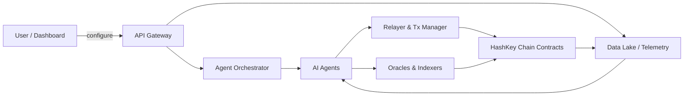
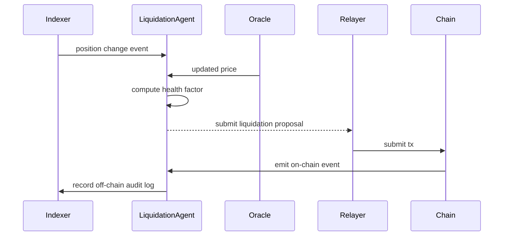

# ARCHITECTURE

Last updated: 2026-06-30

This document describes the high-level and component-level architecture for AtlasOS — an autonomous AI agent network that manages risk, yield, liquidations, and treasury operations on HashKey Chain.

Table of Contents
- Overview
- Components
- Data Flow
- Smart Contract Surface
- Deployment & Infrastructure
- Scalability & Reliability
- Observability
- Example Diagrams

Overview

AtlasOS is built as a hybrid on-chain / off-chain system: off-chain AI agents analyze indexed on-chain data and market feeds, make decisions and propose transactions, and on-chain smart contracts enforce policies, capability tokens, and record auditable logs. The system is non-custodial: funds remain in protocol/user control; AtlasOS executes actions using delegated capability, multisig, or user-signed transactions.

Components

1. Frontend
- Next.js + React + TypeScript
- Marketing site, docs, dashboard, sandbox UI
- Wallet integrations: WalletConnect / browser extensions / enterprise-signers

2. API & Backend
- Node.js / TypeScript services
- GraphQL and REST endpoints for dashboard and orchestration
- Auth & Org management, policy repository, telemetry ingestion

3. Agent Orchestrator
- Kubernetes cluster hosting AI agents as microservices
- Worker types: RiskManager, YieldOptimizer, Liquidator, TreasuryManager, Auditor
- Job queue (Kafka/RabbitMQ) for event-driven tasks and backtests

4. Model Serving
- Model stores (S3) and serving infra (Triton/TorchServe/FastAPI)
- GPU nodes for heavy training/inference, CPU nodes for lightweight inference

5. Indexer & Data Layer
- Chain indexer (custom or The Graph) transforms chain events into normalized schemas
- Time-series DB / analytics (ClickHouse / Timescale / ClickHouse)
- Feature store for ML (DuckDB / vector DB)
- Object storage for logs and snapshots (S3-compatible)

6. Smart Contracts (HashKey Chain)
- AgentRegistry: register agent metadata and owner
- PolicyManager: stores policy templates and constraints
- ExecutionCoordinator: verify delegated capability & execute or log transactions
- OnChainLogs: append-only event logs for all agent decisions and actions

7. Transaction Manager / Relayer
- Relayer services that submit transactions to HashKey Chain
- Supports private mempool submission / bundle submission partners
- Integrates with HSM or enterprise signing services

8. Oracles & Indexers
- Multi-source price aggregation (Chainlink + partner oracles)
- External market data and depth feeds

9. Governance & Multisig
- DAO or multisig workflows for approvals; timelock for critical upgrades

Data Flow

1. Indexer consumes blockchain events and populates the historical DB.
2. Oracles provide price and market feeds to the feature store and real-time event bus.
3. Agents subscribe to sanitized data streams and pull features for inference.
4. Agent computes a decision and produces a signed proposal (with rationale and confidence score).
5. Proposal is evaluated against PolicyManager and, depending on impact, either executed by the relayer or escalated for governance approval.
6. ExecutionCoordinator records the final action to OnChainLogs and the transaction is submitted to HashKey Chain.

Smart Contract Surface

- AgentRegistry
  - registerAgent(agentId, metadataUri)
  - updateAgent(agentId, metadataUri)
  - revokeAgent(agentId)

- PolicyManager
  - setPolicy(policyId, policyHash)
  - getPolicy(policyId)
  - linkPolicyToAgent(agentId, policyId)

- ExecutionCoordinator
  - proposeAction(agentId, actionHash, meta)
  - approveAction(actionId) // for governance/multisig
  - executeAction(actionId, txData)

- OnChainLogs
  - logEvent(entity, eventType, dataHash)

Deployment & Infrastructure

- Kubernetes (EKS/GKE/AKS) with separate namespaces per environment (dev/staging/prod)
- GPU node pools for model training/inference; CPU pools for stateless agents
- CI/CD pipelines for smart contracts, backend, and frontend; Canary and blue/green deployments for critical services
- Secret management using Vault; HSM for key material used by relayers
- Optional enterprise private deployment: customer VPC with private indexer and model store

Scalability & Reliability

- Agents are stateless and horizontally scalable.
- Indexer is the main scaling constraint; partition by block range and parallelize ingestion.
- Use message queue for backpressure and smoothing spikes (Kafka/RabbitMQ).
- Database sharding for high-throughput historical analytics (ClickHouse/Timescale).
- Circuit breakers and fallback deterministic rules for agent downtime.

Observability

- Metrics: Prometheus + Grafana for SLO dashboards (inference latency, queue lag, tx success rate)
- Logs: ELK stack (or hosted equivalent)
- Traces: OpenTelemetry for request tracing across services
- Alerts: PagerDuty/Sentry for incidents and anomaly detection

Example Diagrams

High-level mermaid flow:

Liquidation sequence (mermaid):

Notes & Next Steps

- Maintain a living ARCHITECTURE.md as the system evolves. Add component runbooks, network diagrams, and provider-specific deployment manifests.
- Add environment-specific diagrams (staging/prod) and cost estimates for cloud GPU usage.
