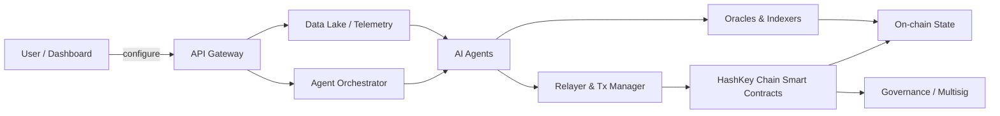
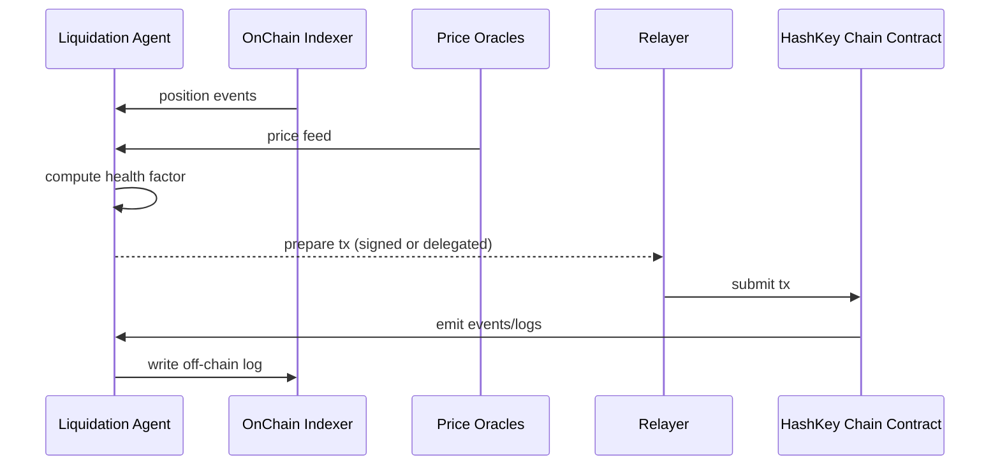

# AtlasOS — Pitch

Last updated: 2026-06-30

---

## Table of Contents

1. Executive Summary
2. Product Overview (Website Sections)
3. Website Walkthrough
4. User Journey
5. Complete Architecture (High-level)
6. AI Architecture
7. Feature-by-Feature Explanation
8. Technical Architecture (services & infra)
9. Security Architecture
10. Why HashKey Chain
11. Competitive Analysis
12. Investor Pitch
13. Demo Flow
14. System Design (scalability & operational)
15. Complete README

---

## 1. Executive Summary

### What AtlasOS is
AtlasOS is an autonomous AI agent network for on-chain finance that manages risk, yield, liquidations, and treasury operations on-chain. AtlasOS combines modular AI agents, secure smart contracts, oracle feeds, and an intuitive user/dashboard layer to deliver non-custodial, transparent, and auditable financial automation for protocols, funds, and DAOs.

### Problem Statement
- DeFi systems face operational complexity: continuous risk monitoring, active yield management, and timely liquidations are resource-intensive and require constant attention.
- Centralized teams and manual scripts scale poorly and introduce single points of failure or long reaction times.
- Existing yield strategies and liquidation engines are often reactive, not adaptive, and cannot optimize dynamically across changing market conditions.
- Protocol treasuries and funds lack autonomous, auditable agents to enforce strategy, optimize returns, and limit downside.

### Solution
AtlasOS provides a composable network of specialized AI agents that run trusted automation on-chain:
- Risk Manager agents perform continuous portfolio analysis and automated mitigation actions.
- Yield Optimizers discover and reallocate capital to high-probability yield strategies.
- Liquidation Agents monitor collateral and execute on-chain liquidations opportunistically and defensibly.
- Treasury Agents manage liquidity, rebalance holdings, and execute governance-approved strategies.
All actions are executed via verifiable smart contract interactions on HashKey Chain with transparent logs and governed constraints.

### Vision
To become the defacto AI operating system for on-chain financial operations — an open, auditable, and extensible platform where protocols, funds, and DAOs plug in policies and capital and get 24/7 autonomous, regulator-aware financial management.

### Why HashKey Chain
HashKey Chain offers a compelling environment for AtlasOS due to:
- Strong institutional relationships and potential compliance tooling that helps institutional DeFi adoption.
- Performance and fee characteristics that make frequent automated transactions economically viable.
- An ecosystem where integrations, custodial solutions, and liquidity partners can enable rapid product-market fit for enterprise-oriented DeFi automation.

---

## 2. Product Overview — Explain every section of the website

For each website section listed below we include: Purpose, Business value, Technical implementation, User benefit, and Why it matters.

### Hero Section
- Purpose: Immediately convey AtlasOS value proposition: autonomous AI-driven on-chain financial operations.
- Business value: Converts enterprise and protocol decision-makers with an instantly clear problem/solution statement.
- Technical implementation: Static hero with animated call-to-action; quick stat widgets (e.g., TVL managed, uptime, average yield uplift).
- User benefit: Rapid understanding; clear CTA to request demo or connect wallet.
- Why it matters: First impression anchors credibility and conversion.

### The AI Operating System for On-Chain Finance (Feature Overview)
- Purpose: Explain the core concept — agent network + contracts.
- Business value: Differentiates AtlasOS as a platform, not a single strategy or protocol.
- Technical implementation: Interactive diagrams (mermaid) and short videos illustrating agent-to-contract flow.
- User benefit: Understand how autonomy is safe, auditable, and governed.
- Why it matters: Demonstrates why AtlasOS is better than standalone bots or manual ops.

### Purpose
- Purpose: Explain mission — make on-chain finance safer, more efficient, and accessible.
- Business value: Increases trust; aligns with enterprises, DAOs, and fund managers.
- Technical implementation: Text + testimonials + use-cases.
- User benefit: Aligns expectations and use cases.
- Why it matters: Foundations for trust and adoption.

### Business Value
- Purpose: Concrete ROI numbers and examples.
- Business value: Showcases how AtlasOS reduces operational costs, increases yield, and lowers liquidation losses.
- Technical implementation: Case studies, metrics, downloadable ROI calculator.
- User benefit: Makes buy/sell decision simpler.
- Why it matters: Investors and buyers need quantified return expectations.

### Technical Implementation
- Purpose: High-level and detailed tech stack overview for devs and security reviewers.
- Business value: Speeds integrations and audits.
- Technical implementation: Architecture diagrams, API docs, smart contract addresses, security reports.
- User benefit: Engineers can evaluate integration effort.
- Why it matters: Reduces risk friction for enterprise adoption.

### User Benefit
- Purpose: Summarize benefits for different personas (treasury, protocol dev, liquidator).
- Business value: Clear messaging for targeted GTM.
- Technical implementation: Persona cards with flows.
- User benefit: Clarifies which user gets what value.
- Why it matters: Increases product resonance.

### Why it matters
- Purpose: Macro-level rationale (market size, automation trends).
- Business value: Persuasive closing argument on home page and pitch decks.
- Technical implementation: Market charts and citations.
- User benefit: Confidence in product mission.
- Why it matters: Helps close enterprise customers and partners.

---

## 3. Website Walkthrough — Every page

- Home
  - Hero, value props, featured metrics, latest audits, quick demo CTA.
- Platform / Product
  - Detailed features, agent gallery, architecture diagram, integrations, APIs.
- Docs
  - Developer docs, smart contract addresses, examples, SDK (TypeScript), API reference.
- Demo / Live Playground
  - Simulated environment for non-custodial demos; connect test wallet, run strategies against fork/sandbox.
- Security & Audits
  - Audit reports, bug bounty program, formal verification notes, responsible-disclosure.
- Pricing / Enterprise
  - Licensing, managed service, SLA, onboarding process.
- Case Studies
  - Examples of yield uplift, rescued positions, treasury returns.
- Governance
  - DAO integration, on-chain governance flows, policy templates.
- Integrations / Partners
  - Oracles, indexers, relayers, custody partners, liquidity providers.
- Blog / Research
  - Research on agent design, risk models, liquidation economics.
- About / Team
  - Founders, advisors, investors, contact.
- Dashboard (authenticated)
  - Overview, agent management, strategy composer, logs, transaction history.
- Support / Contact
  - Support portal, bug reporting, enterprise contact.

---

## 4. User Journey

Persona examples: Protocol Operator, Treasury Manager, Liquidator/Arbitrage Specialist.

1. Discovery
   - User lands on Home, reads Hero and Product pages, views metrics and case studies.
2. Evaluate / Demo
   - Requests demo or uses sandbox demo page to see agents in action.
3. Onboarding
   - Create account, link org wallet or multisig (read-only and action roles), pick policy templates.
4. Configure
   - Choose agent types (risk, yield, liquidation, treasury), set policy constraints (max slippage, risk budget, governance approval requirement).
5. Simulate
   - Run backtests and forked-sandbox simulations with historical data to see potential outcomes.
6. Approve & Deploy
   - Propose strategy to protocol's DAO or multi-sig; after approval, agents are authorized via on-chain capability tokens.
7. Operate
   - Agents monitor, recommend, and/or execute per policy. All actions logged on-chain and visible in the Dashboard.
8. Review & Govern
   - Review agent logs and metrics, adjust policies, run new strategies.

Key experience details:
- Non-custodial: AtlasOS never holds user funds; actions are executed by authorized EOA or relayer constrained by smart contracts.
- Governance-first: Any agent behavior beyond thresholds requires multisig/DAO approval.

---

## 5. Complete Architecture — High-level

Components:
- Frontend (React/TypeScript) — marketing, dashboard, sandbox.
- API Gateway & Backend (Node/TS) — orchestrates agent config, telemetry, user management, SDK.
- Agent Orchestrator (Kubernetes) — hosts AI agents as microservices (Risk, Yield, Liquidator, Treasury).
- Model Serving (GPU/CPU clusters) — hosts models for inference.
- Smart Contracts (HashKey Chain) — access control, on-chain logs, execution coordinator, capability tokens.
- On-chain Relayer / Transaction Manager — constructs, signs (if allowed), and relays signed transactions via user relayers or kit.
- Oracles & Indexers — price feeds (Chainlink/partners), historical indexer (The Graph or custom).
- Data Lake & Observability — time-series DB, object storage, metrics, logs.
- Security & Governance — multisig, emergency kill-switch, audit trail.

Mermaid high-level diagram:



Data flow:
- Agents consume priced, indexed on-chain data and oracle feeds, run decisions (inference), and propose transactions.
- Governance modules sign or approve actions depending on policy level.
- Approved transactions are executed on-chain; events written to on-chain logs and off-chain telemetry.

---

## 6. AI Architecture

Agent types:
- Risk Manager Agent
  - Inputs: real-time prices, position data, volatility metrics, user-defined risk policies.
  - Models: hybrid rule-based + ML classifiers for anomaly detection and probabilistic risk scoring.
  - Outputs: mitigation proposals (deleveraging, rebalancing).
- Yield Optimizer Agent
  - Inputs: protocol APYs, liquidity depth, gas costs, impermanent loss simulations.
  - Models: bandit/MAB algorithms and meta-optimization (learn which strategies compound best).
  - Outputs: allocation proposals and rebalancing instructions.
- Liquidation Agent
  - Inputs: collateral ratios, health factors, mempool awareness.
  - Models: priority queue + profitability estimator to attempt safe liquidation transactions and MEV-aware execution.
  - Outputs: on-chain liquidation transactions via relayer or marketplace.
- Treasury Manager Agent
  - Inputs: treasury holdings, risk preferences, market conditions.
  - Models: portfolio optimization (mean-variance + CVaR), execution slicing.
  - Outputs: rebalance and hedging actions.

AI system design:
- Training pipeline:
  - Data extraction (indexer), labeling (historical liquidations, yield outcomes), offline training (PyTorch/TF), evaluation.
- Serving pipeline:
  - Low-latency inference via model servers (TorchServe/Triton) or optimized microservices.
  - Fallback deterministic rules if ML model unavailable.
- Closed-loop learning:
  - Agents log outcomes; results feed back into training data for periodic retraining.
- Safety & explainability:
  - Each agent exposes decision rationale and confidence scores; deterministic guardrails block unsafe actions.

Security for AI:
- Sign-off workflows: any high-impact action requires human sign-off or governance approval.
- Simulation sandbox: every proposed action is simulated on a fork (or EVM snapshot) and estimated cost/gains shown.

---

## 7. Feature-by-Feature Explanation

- Autonomous Agents (Risk/Yield/Liquidation/Treasury)
  - Explanation: Specialized microservices that operate under policy constraints and interact with smart contracts.
- Strategy Composer
  - Explanation: GUI and SDK to create and compose strategies by wiring agents and policy modules.
- Policy Engine
  - Explanation: Declarative policy language (JSON/YAML) that encodes thresholds, approvals, and constraints.
- Sandbox & Backtesting
  - Explanation: Run strategies against historical data and forked chains to estimate outcomes and risks.
- Transparent Audit Trail
  - Explanation: Every decision and on-chain action logged; proofs/receipts available for independent verification.
- Governance Integrations
  - Explanation: Meshes with DAO/multisig flows for approvals, upgradeability, and strategy proposals.
- Marketplace / Plugin Ecosystem
  - Explanation: Third-parties can publish agent plugins and strategies reviewed and optionally signed.
- Relayer & MEV-aware Execution
  - Explanation: Transaction execution layer that can compete in mempool while respecting policies and front-running protections.
- Observability & Alerts
  - Explanation: Real-time metrics, alerting, dashboards and incident playbooks.

---

## 8. Technical Architecture (services & infra)

Service breakdown:
- Frontend: React + TypeScript; Next.js for marketing and dashboard; uses Web3 modal for wallet connect.
- Backend API: Node.js / TypeScript; GraphQL API for dashboard; REST for agent orchestration.
- Agent Orchestrator: Kubernetes cluster; each agent is a containerized service; autoscaling based on metrics.
- Model Serving: GPU nodes (for heavy models) + CPU inference cluster; left-padded FIFO queue, autoscaled.
- Data Layer: 
  - Indexer: Dedicated chain indexer (custom or The Graph) to transform on-chain events into normalized schemas.
  - Time-series DB: Prometheus/InfluxDB for metrics.
  - Historical DB: Postgres + vector DB for time-series feature store (e.g., DuckDB or ClickHouse for bulk analytics).
  - Object store: S3-compatible for logs, models, and snapshots.
- Smart Contracts:
  - Core contracts: AgentRegistry, PolicyManager, ExecutionCoordinator, OnChainLogs.
  - Upgradability: Proxy patterns or governance-managed upgrades (with timelock).
- Transaction Manager:
  - Supports user-signed txs, relayer execution, and optional programmatic signatures via constrained capability tokens.
- SDKs:
  - TypeScript SDK for integrators. (Repository is TypeScript heavy.)
- CI/CD:
  - Automated tests for smart contracts (Hardhat/Foundry), integration tests, model validation suite.
- Monitoring:
  - Logs (ELK), metrics (Prometheus + Grafana), security alerts, anomaly detection feed to Ops.

Deployment model:
- Cloud-first for agent & model hosting; optionally on-premise/hybrid for enterprise customers with privacy requirements.

---

## 9. Security Architecture

Threat model & mitigations:

- Smart Contract Risks
  - Threats: reentrancy, overflows, logic bugs.
  - Mitigation: audits (third-party), unit & fuzz tests, formal verification where appropriate, timelocks on critical operations.
- Agent Misbehavior
  - Threats: rogue agent executes harmful action.
  - Mitigation: policy constraints, human-in-the-loop for high-impact actions, capability tokens with limited scope, circuit breakers.
- Oracle Manipulation
  - Threats: price feed manipulation causing wrong decisions.
  - Mitigation: multi-oracle aggregation (median/trimmed mean), sanity checks, cross-protocol verification.
- MEV & Front-running
  - Threats: exploiters front-run liquidation transactions.
  - Mitigation: private mempool submission strategies, transaction bundling via relayer partners, flashbots-like submission if supported.
- Credential & Key Management
  - Threats: secrets leak, compromised keys.
  - Mitigation: hardware HSMs for signing relayer keys, vaults (HashiCorp Vault/Azure KeyVault), strict RBAC.
- Data Integrity & Privacy
  - Threats: leaked telemetry or sensitive metadata.
  - Mitigation: encryption at rest/in transit, data minimization, role-based data access.
- Operational & Third-party Risk
  - Threats: compromised oracles, indexers, cloud infra.
  - Mitigation: redundancy, hardened SLAs, periodic penetration tests, incident response runbooks.
- Governance Attack
  - Threats: compromised governance or multisig.
  - Mitigation: multi-party warranties, time-delays, emergency pause keys under distributed custody.

Security controls:
- Bug bounty program.
- Continuous monitoring and alerting for anomalous on-chain activity.
- Immutable on-chain logs + off-chain verifiable receipts for post-incident forensics.
- Formal security reviews and open audit reports on Security page.

---

## 10. Why HashKey Chain (expanded)

- Enterprise Orientation: HashKey Group is an institutional-focused ecosystem; AtlasOS targets enterprise and regulated protocols that prefer enterprise-grade blockchains.
- Efficiency: Lower transaction costs and faster confirmation times reduce operational friction for frequent autonomous actions.
- Ecosystem & Integrations: Closely aligned custody, compliance, and liquidity providers in HashKey’s ecosystem assist go-to-market and partnership opportunities.
- Compliance & Trust: Institutional-friendly tooling and potentially improved compliance primitives make it easier for treasury integrations.
- Developer Experience: EVM-compatible tooling (if applicable) and existing dev ecosystem speed integration.

Note: If specifics (e.g., EVM compatibility) are required in implementation docs, verify HashKey Chain technical docs for exact compatibility and RPC endpoints.

---

## 11. Competitive Analysis

Categories compared:
- Yield Optimizers (e.g., Yearn)
  - Strengths: proven yield aggregation, vault strategies.
  - Weaknesses: not agent-oriented or generalized operations; manual upgrades and strategy specialization.
- Risk Tools & Liquidation Bots (custom scripts, MEV bots)
  - Strengths: niche expertise in liquidation.
  - Weaknesses: brittle, manual, single-purpose.
- On-chain AI / Agent projects (e.g., Autonolas-like, emerging AI agent frameworks)
  - Strengths: autonomous agents focus.
  - Weaknesses: early stage, limited DeFi specialization or enterprise integrations.
AtlasOS differentiation:
- Composability: network of specialized agents with governance and policy engine.
- Enterprise & Compliance-first approach: non-custodial but institutionally oriented integrations.
- Full product suite: agent orchestration, sandbox/backtesting, SDKs, relayer, auditability.
- Focus on treasury & protocol-level automation, not just yield aggregation.

---

## 12. Investor Pitch

Elevator pitch:
"AtlasOS is an AI operating system for on-chain finance that runs autonomous, auditable agent networks to manage risk, maximize yield, and execute liquidations — enabling protocols, DAOs, and treasuries to operate 24/7 with enterprise-grade governance."

Market opportunity:
- DeFi TVL and institutional treasury allocations are expanding; automation demand is growing.
- Market segments: protocol operations, DAOs, institutional treasuries, DeFi hedge funds, and liquidators/MEV operators.

Business model:
- Managed service (SaaS + enterprise license).
- Revenue share on yield uplift or liquidations (optional).
- Marketplace fees for third-party agent plugins.
- Professional services for integration and audit.

Traction & go-to-market:
- Pilot with 2-3 protocol partners on HashKey Chain and other compatible chains.
- Focus on treasury teams and protocols concerned with automation and risk reduction.
- Partnerships with oracles, relayers, custody providers.

Ask:
- Funding for continued engineering, security audits, model research, and enterprise onboarding.
- Strategic partners for custody, relaying, and market-making.

---

## 13. Demo Flow

1. Pre-demo prep
   - Demo environment: forked testnet with test assets and pre-seeded positions.
2. Landing page & product pitch (1-2 min)
3. Dashboard login & wallet connect (1 min)
4. Walkthrough of a simple onboarding: policy template selection (Risk Aware Treasury) (2 min)
5. Sandbox simulation: run yield optimizer with historical data — show result graphs (3 min)
6. Approve & deploy: show governance approval flow (simulate DAO/multisig) (2 min)
7. Live agent action: show an agent detecting a health-factor drop and triggering a pre-approved rebalancing transaction (3 min)
8. Post-action: show on-chain event, off-chain logs, and ROI analysis (2 min)
9. Q&A: answer security and integration questions.

Total: ~20 minutes.

---

## 14. System Design

Scalability
- Stateless microservices for agents; scale horizontally.
- Indexer and DB shards for high throughput (ClickHouse/Timescale for historical analytics).
- Queue-based decoupling (Kafka/RabbitMQ) between indexer, agent services, and model servers.

Reliability
- Multi-region deployment with failover.
- Circuit breakers and retry strategies.
- Graceful degradation: agents fallback to rules when models unavailable.

Latency
- Critical for liquidation agents: low-latency market data, private tx submission, and local mempool monitoring.
- Use proximity deployments and dedicated relay partners in target chain regions.

Observability & SLAs
- SLOs for agent responsiveness and model inference latency.
- Alerting for policy violations, failed executions, and suspicious patterns.

Upgradeability
- Smart-contract upgrades guarded by governance timelock and multisig.
- Blue/green deploys for agents, canary testing for model changes.

Privacy & Compliance
- Option for enterprise on-premise deploys where models and logs remain within customer VPC.
- Audit logs and data export for compliance reporting.

---

## 15. Complete README

### AtlasOS — README (summary)

AtlasOS is an autonomous AI agent network that manages risk, yield, liquidations and treasury on HashKey Chain — non-custodial, transparent, on-chain.

Quick links:
- Website: (TBD)
- Docs: /docs
- Repo: github.com/sangamitra22/atlasos
- Contact: hello@atlasos.xyz (replace as appropriate)

Getting started (developer)
1. Clone
   - git clone https://github.com/sangamitra22/atlasos.git
2. Install
   - npm ci
3. Local dev
   - Frontend: cd web && npm run dev
   - Backend: cd api && npm run dev
   - Smart contracts: cd contracts && npm install && npm run test
4. Deploy (high-level)
   - Smart contracts: deploy via Hardhat/Foundry, ensure you set network RPC to HashKey Chain RPC (confirm endpoint).
   - Backend: containerize and deploy to Kubernetes, set environment variables for RPC, oracles, and secrets.
   - Agent cluster: deploy to K8s with autoscaling and model serving infra.

Architecture overview
- See /ARCHITECTURE.md for diagrams and detailed component descriptions.

Contributing
- Open PRs for docs and agents.
- Security: report any vulnerability to security@atlasos.xyz and follow responsible disclosure.
- Code style: Prettier, ESLint, TypeScript strict mode.

Tests
- Smart contract tests: Foundry/Hardhat.
- Unit tests for Node/TS services: Jest.
- Integration tests: use localchain / forked testnets.

License
- MIT (or choose your license)

Contact & Governance
- For enterprise integrations and audits: contact enterprise@atlasos.xyz
- Governance: initial governance controlled by founding multisig until DAO handoff.

---

## Appendix: Policy & Example Files

Example policy (JSON):

```json
{
  "policyName": "ConservativeTreasury",
  "maxExposurePerAsset": 0.2,
  "maxSlippage": 0.005,
  "liquidationApprovalRequired": true,
  "dailyTxLimitUsd": 50000,
  "emergencyPauseKey": "0x...multisig..."
}
```

Example mermaid sequence for a liquidation flow:



---

## Notes, Next Steps & Recommendations

What I generated:
- A complete pitch.md covering executive summary, product overview, architecture, AI design, security, investor pitch, demo flow, system design, and a README summary.

What I recommend next:
1. Confirm HashKey Chain RPC and EVM compatibility details to finalize deployment docs and SDK configuration.
2. Draft concrete policy DSL and policy templates for common personas (treasury, protocol, liquidator).
3. Prepare a sandbox/fork for demo and pilot integrations with 1-2 partner protocols.
4. Run a security audit plan schedule and bug-bounty timeline.

If you want, I can:
- Convert the policy examples into a formal DSL and TypeScript schema.
- Generate the Architecture.md and a full README.md file ready for the repo.
- Produce the TypeScript SDK skeleton (index, client, types) for integration.

---

If you'd like any section expanded (e.g., full smart contract interfaces, policy DSL, or the README expanded into repo-ready files), tell me which part to generate next and I'll create the files (and can push if you provide the target repo/branch details).
